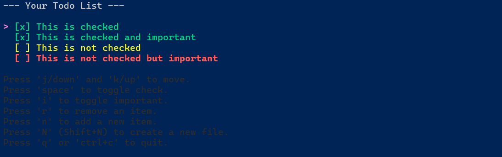
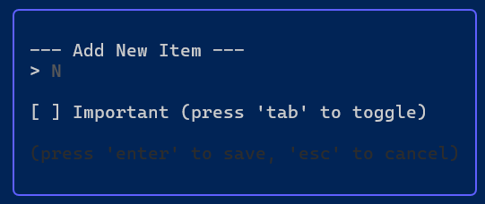
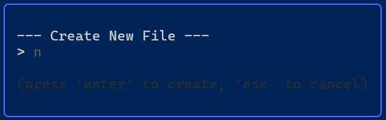

# go-check
A simple to-do viewer in go 
<p style="text-align: left">
  
</p>

# License
> Why not? Like what else am I supposed to put here ¯\_(ツ)_/¯

MIT License

Copyright (c) 2025 grish-ka

Permission is hereby granted, free of charge, to any person obtaining a copy
of this software and associated documentation files (the "Software"), to deal
in the Software without restriction, including without limitation the rights
to use, copy, modify, merge, publish, distribute, sublicense, and/or sell
copies of the Software, and to permit persons to whom the Software is
furnished to do so, subject to the following conditions:

The above copyright notice and this permission notice shall be included in all
copies or substantial portions of the Software.

THE SOFTWARE IS PROVIDED "AS IS", WITHOUT WARRANTY OF ANY KIND, EXPRESS OR
IMPLIED, INCLUDING BUT NOT LIMITED TO THE WARRANTIES OF MERCHANTABILITY,
FITNESS FOR A PARTICULAR PURPOSE AND NONINFRINGEMENT. IN NO EVENT SHALL THE
AUTHORS OR COPYRIGHT HOLDERS BE LIABLE FOR ANY CLAIM, DAMAGES OR OTHER
LIABILITY, WHETHER IN AN ACTION OF CONTRACT, TORT OR OTHERWISE, ARISING FROM,
OUT OF OR IN CONNECTION WITH THE SOFTWARE OR THE USE OR OTHER DEALINGS IN THE
SOFTWARE.

# Installation
## Option 1: go install
1. Install go
2. Install the package,
to install the package you run
```bash
$ go install github.com/grish-ka/go-check@latest
```

> Note by dev: <br>
> If you want a specific version replace `@latest` with `@VersionHere`

> Another Note:
> you need some modules if you are directly building it
```bash
 go get github.com/charmbracelet/bubbletea
 go get github.com/charmbracelet/lipgloss
```
## Option 2: .msi Install
1. go to the latest release and download `go-check.msi`
2. run it and you have it installed!

# Usage
## Creating a todo **json** file
after you instal go to your directory you want to put your todo **json** file in
and run
```powershell
go-check --new "My first todo!" -file 'exampleTodo.json'
```
then to open it run
```powershell
go-check -file 'exampleTodo.json'
```
<p style="text-align: left">
  
</p>

## Making an new item
its easy press 'n' in the main menu
<p style="text-align: left">
    you will see this
  
</p>

fill it in and done new item
## Creating a todo **json** file (GUI)

its easy press 'Shift+N' in the main menu
<p style="text-align: left">
    you will see this
  
</p>

fill it in and done new file